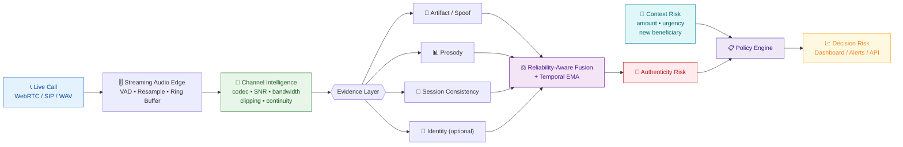
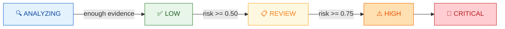

<div align="center">

# 🎙️ STRIVE

### AI-Powered Real-Time Detection and Prevention of Voice Cloning Impersonation Attacks

**A privacy-first, multilingual voice integrity layer for live calls**

*Real Voices, Safer Tomorrows*

<br>

[](https://sih.gov.in/)
[](https://sih.gov.in/)
[](https://sih.gov.in/)
[](https://www.iiserb.ac.in/)

[](https://www.python.org/)
[](https://fastapi.tiangolo.com/)
[](https://pytorch.org/)
[](https://faiss.ai/)
[](#-verify-the-build)
[](#-measured-performance)
[](#%EF%B8%8F-why-it-is-feasible)

<br>

**Organization:** AICTE Cyber Security Cell &nbsp;•&nbsp; **Category:** Software &nbsp;•&nbsp; **Team:** STRIVE

</div>

---

> [!IMPORTANT]
> **Honesty first.** The default demo runs on measured DSP features and procedural audio fixtures. **It is not a trained voice-clone detector,** and every demo API event says so with `demo_only: true`. The research path loads frozen public models but has **not** been validated for speech accuracy. No benchmark number in this repository is invented. See [what is and is not validated](#%EF%B8%8F-what-is-and-is-not-validated).

---

## 🎯 The problem

<table>
<tr>
<td width="50%" valign="top">

### ⚠️ Today

- Voice cloning now works from **a few seconds** of audio
- Fraudsters impersonate **CXOs, officials and trusted callers**
- Caller ID, manual callback and voice familiarity are **no longer enough**
- Live fraud over VoIP, mobile and enterprise calls needs **real-time** detection

</td>
<td width="50%" valign="top">

### 💡 Our approach

- Continuously analyze **live or near-live** call audio
- Multi-layer evidence: **acoustic artifacts, prosody, session consistency, channel cues**
- Compute a **dynamic impersonation risk score during the call**
- Trigger alerts and **secondary verification before sensitive action is taken**

</td>
</tr>
</table>

> ### 🛡️ Protect the action, not punish the caller.
> STRIVE never auto-terminates a call. It holds the *transaction* and asks for a second factor. A false positive costs a callback, not a customer.

---

## 🧭 How it works



### The three risks stay separate

This is the design decision we care most about. Collapsing them hides *why* a call was flagged.

| Risk | What it measures | What can change it |
|---|---|---|
| 🎙️ **Authenticity** | Is this audio synthetic or manipulated? | **Only acoustic evidence.** Business context can never touch it. |
| 💼 **Context** | Is this *request* risky? | Transaction amount, urgency, new beneficiary, privileged request |
| ⚖️ **Decision** | What should the operator do? | Combines both — the *only* place they mix |

A unit test enforces the separation: context metadata cannot move `authenticity_risk`.

### Policy bands



| State | Action | Meaning |
|---|---|---|
| 🔍 `ANALYZING` | await evidence | Not enough voiced audio yet. **Never shown as safe.** |
| ✅ `LOW` | monitor | No anomaly. *Not* a claim the speaker is verified. |
| 📋 `REVIEW` | verify caller | Secondary verification |
| ⚠️ `HIGH` | hold action | Sensitive action held pending verification |
| 🚨 `CRITICAL` | escalate | Route to fraud analyst |

> [!NOTE]
> **Silence never produces `LOW`.** A stream that has not accumulated enough voiced audio reports `ANALYZING` with reason `LOW_EVIDENCE`. Branch failures produce explicit uncertainty, never a comfortable zero.

---

## ⚡ Quick start

<details open>
<summary><b>🚀 Zero-install demo (30 seconds)</b></summary>

<br>

Open **`STRIVE_Demo.html`** in any modern desktop browser. Pick **Mid-call change** → **Run scenario**.

It replays JSON produced by the real Python API — no install, no internet, no backend. It does not capture a microphone or run models.

</details>

<details>
<summary><b>🐧 Full local app — Linux / macOS</b></summary>

<br>

```bash
python3 -m venv .venv
.venv/bin/python -m pip install -r requirements-demo.lock
.venv/bin/python scripts/start.py
```

Open **http://127.0.0.1:8000** — loopback only by default. Click **Use microphone** and speak.

Audio decoding supports WAV/FLAC through SoundFile. Install FFmpeg for other formats.

</details>

<details>
<summary><b>🪟 Full local app — Windows PowerShell</b></summary>

<br>

```powershell
py -3.12 -m venv .venv
.\.venv\Scripts\python.exe -m pip install -r requirements-demo.lock
.\.venv\Scripts\python.exe scripts\start.py
```

`scripts/setup.ps1` does the first two steps if your execution policy allows scripts.

</details>

<details>
<summary><b>🐳 Docker</b></summary>

<br>

```bash
export STRIVE_API_TOKEN='choose-a-long-local-secret'
docker compose up --build
```

Compose binds the host port to loopback. Enter the token via **API access** in the dashboard.

</details>

<details>
<summary><b>🔬 Research mode (frozen neural models)</b></summary>

<br>

Read [`docs/MODELS.md`](docs/MODELS.md) first — the NII Fairseq export needs a **separate Python 3.10 environment**.

```bash
python -m pip install -r requirements-research.txt
python scripts/prepare_models.py --download --variant mms-300m --include-language
# ...export and seal the model bundle, then:
python scripts/start.py --research
```

Missing models, bad hashes, fixture indexes and CM/index version mismatches **fail startup**. They never silently fall back to demo features.

</details>

<details>
<summary><b>🎧 Stream a WAV as if it were a live call</b></summary>

<br>

```bash
# deterministic, as fast as the machine allows
python scripts/stream_wav.py --scenario switch --mode accelerated --hop 0.5

# paced to 1x wall clock, to observe queue delay
python scripts/stream_wav.py --wav call.wav --mode realtime --events out.jsonl

# full latency report
python scripts/stream_wav.py --scenario switch --hop 0.5 --multi-rate --benchmark
```

</details>

<details>
<summary><b>📻 Build the codec robustness matrix</b></summary>

<br>

```bash
python scripts/augment.py list          # 15 registered conditions
python scripts/augment.py matrix --manifest data/manifest.csv \
       --out-dir data/degraded --out-manifest data/manifest_matrix.csv
```

Opus 6/12/16/24/32 kbps • G.711 μ-law & A-law • 8 kHz narrowband • noise at 20/10/5 dB • packet loss 1/3/5%

</details>

---

## 📊 Measured performance

Real numbers from actual runs. Nothing here is estimated.

**Scenario `switch`, 40 s, DSP surrogate, CPU only:**

| Window / hop | Multi-rate | p50 | **p95** | Realtime factor |
|---|:---:|---:|---:|---:|
| 2.0 s / 1.0 s | ✗ | 5.21 ms | **5.88 ms** | 194.7× |
| 2.0 s / 0.5 s | ✗ | 6.21 ms | **11.14 ms** | 99.8× |
| **2.0 s / 0.5 s** | **✓** | **5.89 ms** | **6.69 ms** | **163.3×** |
| 4.0 s / 0.5 s | ✓ | 11.33 ms | **12.40 ms** | 89.8× |

<sub>AMD Ryzen 9 7950X, 32 threads. Full report in <code>evidence/latency-benchmark.json</code></sub>

<details>
<summary><b>📈 The multi-rate scheduler reproduces across hardware</b></summary>

<br>

Branch cadences run on the **audio timeline**, not wall clock — so an accelerated offline replay schedules branches exactly as a live call would, and benchmarks stay reproducible.

| Hardware | Multi-rate OFF | Multi-rate ON | Speedup |
|---|---:|---:|---:|
| Intel i5-1235U (laptop) | 32.7× | 54.4× | **1.67×** |
| AMD Ryzen 9 7950X | 99.8× | 163.3× | **1.63×** |

Same gain on completely different silicon — the scheduler win is real, not a thermal artifact. Zero windows exceeded budget in any geometry.

</details>

<details>
<summary><b>🔬 Per-stage breakdown (2 s / 0.5 s, multi-rate)</b></summary>

<br>

| Stage | p50 | p95 | Runs |
|---|---:|---:|---:|
| artifact | 3.52 ms | 4.43 ms | 39 |
| channel | 1.10 ms | 1.29 ms | 77 |
| session | 0.46 ms | 0.80 ms | 39 |
| vad | 0.02 ms | 0.03 ms | 77 |
| fusion | 0.01 ms | 0.02 ms | 77 |

Fusion refreshes every hop; the expensive artifact branch runs at half rate and its recent result is reused, with explicit staleness expiry.

</details>

---

## 🧩 Key engineering decisions

<details>
<summary><b>📡 Channel intelligence — reliability, not suspicion</b></summary>

<br>

A degraded channel means our evidence is **less trustworthy**. It is *never* itself evidence of a clone.

Measured per window, deterministic, no model: occupied bandwidth (99% spectral rolloff), SNR proxy (minimum-statistics spectral floor), clipping ratio, RMS dBFS, cross-window discontinuity, and a conservative `quality` scalar.

Verified separation across real codec round-trips:

| Condition | Bandwidth | SNR | Quality |
|---|---:|---:|---:|
| clean | 6219 Hz | 60.0 dB | 0.946 |
| Opus 6 kbps | 1438 Hz | 51.2 dB | 0.750 |
| G.711 μ-law | 1438 Hz | 60.0 dB | 0.750 |
| 8 kHz narrowband | 1438 Hz | 60.0 dB | 0.750 |
| noise 10 dB | 7125 Hz | **19.3 dB** | 0.915 |

**Unavailable values are `null`, never a fake zero.**

</details>

<details>
<summary><b>🚦 Missing ≠ stale ≠ zero</b></summary>

<br>

Fusion must never mistake absent evidence for a clean signal.

| State | `available` | `score` | Reason code |
|---|:---:|:---:|---|
| Never ran | `false` | `null` | `BRANCH_NOT_YET_RUN` |
| Fresh | `true` | value | — |
| Expired | `false` | `null` | `BRANCH_STALE` |

Weights renormalize over available branches only. An absent identity branch does not contribute `0.0` as if it were proof of genuineness.

</details>

<details>
<summary><b>🎛️ Inference stalls cannot block audio capture</b></summary>

<br>

`Call.ingest()` validates, buffers and enqueues — **it never touches a model**. `Call.drain()` scores. A bounded queue joins them.

Measured: ingesting 6 frames against a deliberately 200 ms/window extractor completes in **under 200 ms with zero model calls**.

On overflow the **oldest** window is dropped, because a live risk score is only useful if it describes current audio. The loss is reported (`CAPTURE_QUEUE_OVERFLOW`), counted, and channel continuity is reset so the gap is not scored as a splice.

</details>

<details>
<summary><b>🔒 Privacy by construction</b></summary>

<br>

- **No raw audio persisted by default.** An integration test checks output directories after a call.
- Audit DB stores an explicit **allow-list**: timestamps, UUID call IDs, scores, reasons, actions, model versions. Never PCM, embeddings, or pitch.
- Pseudonymous UUID call IDs — phone numbers are never identifiers.
- Uploads decode **in memory**; no multipart temp files.
- Every event carries model and pipeline version for provenance.

</details>

---

## ⚠️ What is (and is not) validated

We would rather ship an honest prototype than an impressive-looking claim.

| | Status |
|---|---|
| ✅ Streaming mechanics, windowing, fusion, policy, dashboard | **Working & tested** (170 tests) |
| ✅ Channel intelligence across real Opus / G.711 / narrowband | **Measured** |
| ✅ Latency p50/p95, realtime factor, multi-rate scheduling | **Measured on two machines** |
| ✅ Codec augmentation matrix + leakage-safe paired manifests | **Working & tested** |
| ⚠️ Genuine-vs-cloned **detection accuracy** (EER / ROC-AUC / TPR@FPR) | **Not measured — needs a licensed corpus** |
| ⚠️ Indian-language and code-mixed performance | **Not measured** |
| ⚠️ Neural model inference (NII CM / XLSR) | **Adapters written, weights not validated here** |
| ❌ SIP / Asterisk / telecom integration | **Not implemented** (REST + WebSocket provided) |

<details>
<summary><b>🐛 Known limitations we chose to record rather than hide</b></summary>

<br>

1. **Packet loss is invisible to the continuity score.** 20 ms zero-erasures do not shift per-window aggregates, so all loss conditions read identical to clean. `packet_loss_rate` must come from the transport, not the waveform.
2. **Bandwidth is content-dependent** — it cannot separate a narrowband channel from a low-pitched or quiet speaker.
3. **SNR is a proxy**, monotonic in added noise but biased roughly +8 dB. Not calibrated.
4. **Mature-call fusion can dilute global evidence.** At age > 60 s the schedule is `[0.30, 0.50, 0.20]`, so a maximal spoof score with stable session/coherence fuses to only `0.30`. A test pins this counterexample on purpose — we will not tune thresholds to hide it.
5. **EMA warm-up.** Three maximum updates from zero give `1 − 0.7³ = 0.657`, below the 0.75 alert. The source diagram's "alert in three chunks" claim is wrong.
6. **Demo fixtures read as a degraded channel** (quality 0.44) because family-0 is a pure harmonic — they cannot validate channel-aware fusion.

</details>

---

## 🗺️ Roadmap

| Week | Milestone | Status |
|:---:|---|:---:|
| 1 | Thin slice: mic/WebRTC → score → dashboard | ✅ |
| 2 | Spoof baseline + telephony/codec data | ✅ |
| 3 | Fusion + prosody + session/identity signals | 🔄 |
| 4 | Optimization: multi-rate inference + ONNX | ⬜ |
| 5 | Evaluation: codec, language, unseen-generator | ⬜ |
| 6 | Demo freeze + offline packaging + rehearsal | ⬜ |

**Key risks and mitigation**

| Risk | Mitigation |
|---|---|
| 🔊 Poor call quality | Codec-aware weighting |
| ⏱️ High latency | Staggered branch cadence |
| ❌ False positives | Verify / hold — never auto-block |
| 🔒 Privacy concerns | Feature-only logging |

---

## 🧪 Verify the build

```bash
python -m pytest -q                 # 170 passed, 1 skipped
node --check web/app.js
node --check web/pcm-worklet.js
node tests/audio_worklet.cjs        # framing at 16k / 44.1k / 48k
python scripts/build_demo.py        # regenerates the portable replay
python scripts/smoke.py             # with the server running
```

The checked-in [`evidence/`](evidence/) directory records what was actually executed.

---

## 📁 Repository map

| Path | Purpose |
|---|---|
| `strive/audio.py` | Decode, normalize, VAD interface, configurable ring buffer |
| `strive/channel.py` | Channel intelligence: bandwidth, SNR, clipping, continuity, quality |
| `strive/features.py` | Demo DSP features and measured acoustic profile |
| `strive/retrieval.py` | Global FAISS partitions and in-session comparison |
| `strive/engine.py` | Three tracks, bootstrap, gates, weights, EMA |
| `strive/branches.py` | Shared branch result schema and availability masking |
| `strive/scheduler.py` | Multi-rate branch cadences and staleness |
| `strive/capture.py` | Bounded capture queue and backpressure counters |
| `strive/telemetry.py` | Per-stage timers and p50/p95 aggregation |
| `strive/policy.py` | Business context and verification policy |
| `strive/api.py` | FastAPI, HTTP/WebSocket, mock actions, health, metrics |
| `strive/models/research.py` | Local frozen model adapters |
| `web/` | Dashboard and microphone AudioWorklet |
| `scripts/` | Setup, download, index, evaluation, augmentation, benchmarks |
| `tests/` | Architecture, stream, API, policy, privacy, codec, latency checks |
| `evidence/` | Measured test and benchmark results |

### 📚 Documentation

| Document | Contents |
|---|---|
| [`docs/ARCHITECTURE.md`](docs/ARCHITECTURE.md) | Design decisions and resolved specification issues |
| [`docs/API.md`](docs/API.md) | HTTP/WebSocket contract and event schema |
| [`docs/LATENCY.md`](docs/LATENCY.md) | Timers, scheduler and measured latency |
| [`docs/CODEC_BENCHMARK.md`](docs/CODEC_BENCHMARK.md) | Codec matrix and paired-manifest rules |
| [`docs/BASELINE.md`](docs/BASELINE.md) | Frozen environment and reproducible baseline |
| [`docs/MODELS.md`](docs/MODELS.md) | Model preparation, contracts and limits |
| [`docs/VALIDATION.md`](docs/VALIDATION.md) | What was actually executed |
| [`docs/REQUIREMENTS.md`](docs/REQUIREMENTS.md) | Requirement coverage |

---

## 🛠️ Why it is feasible

<div align="center">

| ⚙️ Open-source stack | 📦 Modular branches | 💻 CPU-first | 🛡️ Step-up verification |
|:---:|:---:|:---:|:---:|
| No mandatory paid APIs | Core path first, optional modules later | Runs without a GPU | Reduces harm from false positives |

</div>

**Grounded in:** anti-spoofing speech encoders • prosody and physiology-inspired voice cues • ECAPA-style speaker verification • channel and replay integrity analysis • Indian-language and telephony robustness evaluation.

**Evaluation plan:** EER / ROC-AUC • TPR at fixed FPR • per-language metrics • codec robustness • leave-one-generator-out • time-to-alert.

**Where it applies:** high-value fund transfer calls • executive and official approval workflows • contact-centre identity-risk checks • enterprise collaboration and telecom voice channels.

---

## 👥 Team

<div align="center">

**Team STRIVE** — [Indian Institute of Science Education and Research (IISER) Bhopal](https://www.iiserb.ac.in/)

Smart India Hackathon 2026 &nbsp;•&nbsp; Problem Statement **SIH26104**

AICTE Cyber Security Cell &nbsp;•&nbsp; Blockchain & Cybersecurity &nbsp;•&nbsp; Software

<br>

*Ministry of Education, Government of India* &nbsp;•&nbsp; *Viksit Bharat @2047*

<br>

### 🔊 Secure Voices · Stronger India

</div>

---

## 📜 License and attribution

Review the source and third-party model licenses before choosing a license for your own deployment. Notable constraints:

- **NII anti-deepfake checkpoints:** CC BY-NC-SA 4.0 — *non-commercial only*
- **ASVspoof 2019:** ODC-BY — permits derivative works, so codec augmentation is allowed
- Third-party notices: [`THIRD_PARTY_NOTICES.md`](THIRD_PARTY_NOTICES.md)

Model weights, secrets, recorded audio, local databases and indexes are excluded by `.gitignore`.

> [!WARNING]
> Use only consenting real speakers and consented spoof samples when evaluating. This project is a fraud-prevention tool; do not use it to generate or distribute cloned voices.
